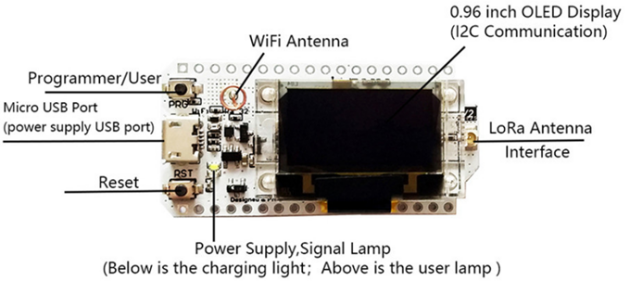
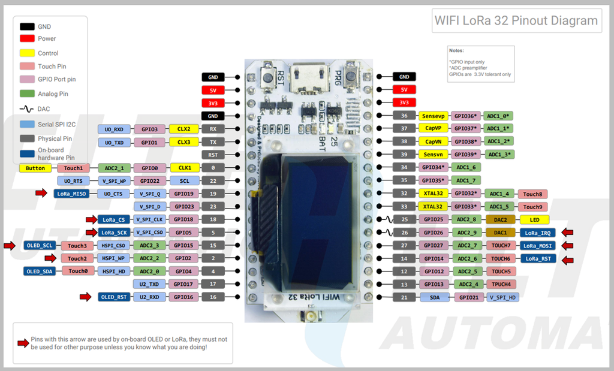
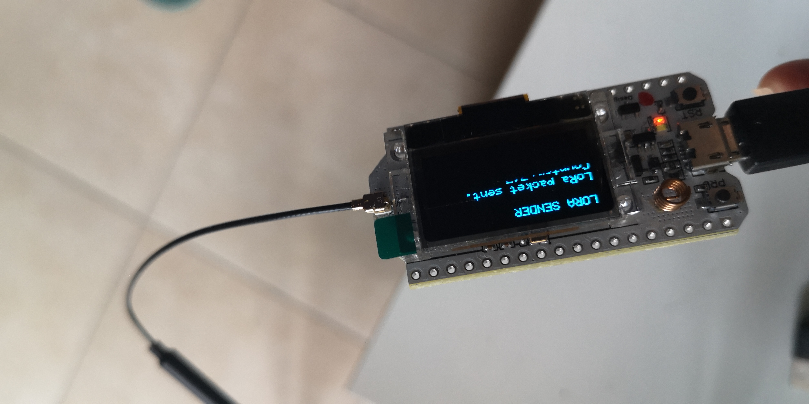

# Module Heltec_lora32_v2

# Libraries to include : 
//Libraries for LoRa

#include <SPI.h>

#include <LoRa.h>

// Libraries for OLED Display

#include <Wire.h>

#include <Adafruit_GFX.h>

#include <Adafruit_SSD1306.h>

# Constants to define

## define the pins used by the LoRa transceiver module

- define SCK 5
- define MISO 19
- define MOSI 27
- define CS 18
- define RST 14
- define IRQ 26

## choose the correct frequency for your location
1. 433E6 for Asia
2. 866E6 for Europe
3. 915E6 for North America
   
- define BAND 866E6

# OLED pins
- define OLED_SDA 4
- define OLED_SCL 15 
- define OLED_RST 16
- define SCREEN_WIDTH 128 // OLED display width, in pixels
- define SCREEN_HEIGHT 64 // OLED display height, in pixels
- define SCREEN_ADDRESS 0x3c

# images du test

